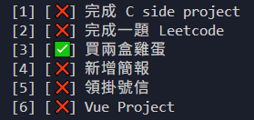

# Todo CLI
<h3 align="center">A simple command-line to-do list tool implemented in C.</h3>

<p align="center">
  
</p>

## Features

- `add "task"`: Add a new to-do item
- `list`: List all to-do items
- `done 2`: Mark item #2 as completed
- `delete 3`: Delete item #3
- `clear`: Clear all completed items


## Usage

### Compile

```bash
make
```

### Run

```bash
./todo add "Do homework"
./todo list
./todo done 1
./todo delete 2
./todo clear
```
The data is stored in `todo.txt`.


## Design Concept

- Store the to-do list in a text file `todo.txt`
- File format: `id|title|done`
- Modularized logic for easy maintenance and extension


## Development Environment

- C language
- GCC compiler
- Supports Unix-like systems (Linux/macOS)


## Future Plans

- Support deadlines and sorting
- Priority categorization
- Export to markdown/html


# Todo CLI

一個簡單的命令列代辦事項工具，使用 C 語言實作。

## 支援功能

- `add "事項"`：新增代辦事項
- `list`：列出所有代辦事項
- `done 2`：標記第 2 項為已完成
- `delete 3`：刪除第 3 項
- `clear`：清除已完成事項


## 使用方法

### 編譯

```bash
make
```

### 執行

```bash
./todo add "寫作業"
./todo list
./todo done 1
./todo delete 1
./todo clear
```
資料會儲存在 `todo.txt`。


## 設計概念

- 使用文字檔 todo.txt 儲存代辦清單
- 檔案格式為：id|title|done
- 所有邏輯模組化，方便維護與擴充


## 開發環境

- C 語言
- GCC 編譯器
- 支援 Unix-like 系統（Linux/macOS）


## 延伸規劃（未來功能）

- 支援截止日期與排序
- 優先度分類
- 匯出成 markdown/html
